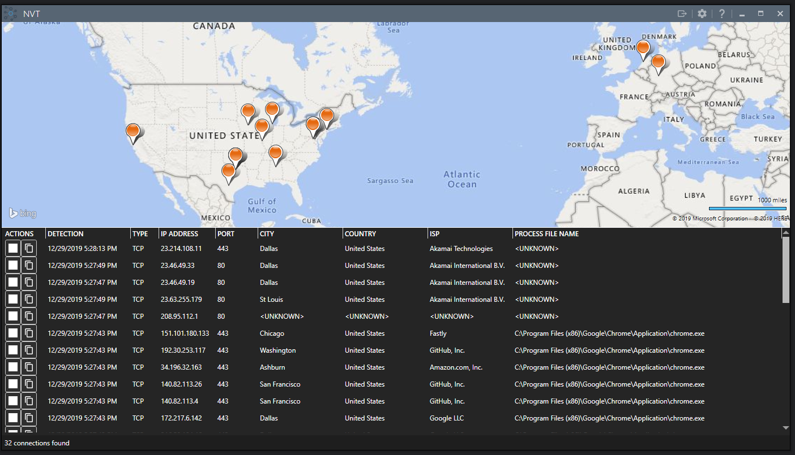

## NVAT

NVAT stands for N)etwork V)isualization T)ool.  It is a WPF .NET Core 3.1 application showing TCP Connections and the processes tied to them to provide end-users more insight into what applications have connections throughout our connected world.

### Features to come before 1.0
* Ability to kill the process from the GUI
* Improved UI/UX (it's a little janky right now)
* Unencrypted traffic inspection (tisk tisk port 80 applications in 2019)
* REST service to route the DNS requests to (in the case of an airgapped environment)
* Unit Test coverage across the board
* Platform abstractions to port to Linux or MacOS
